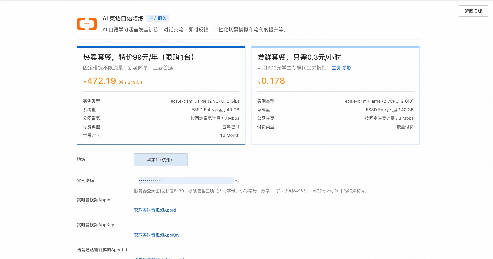
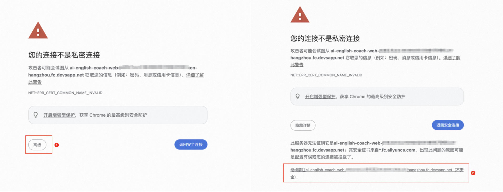
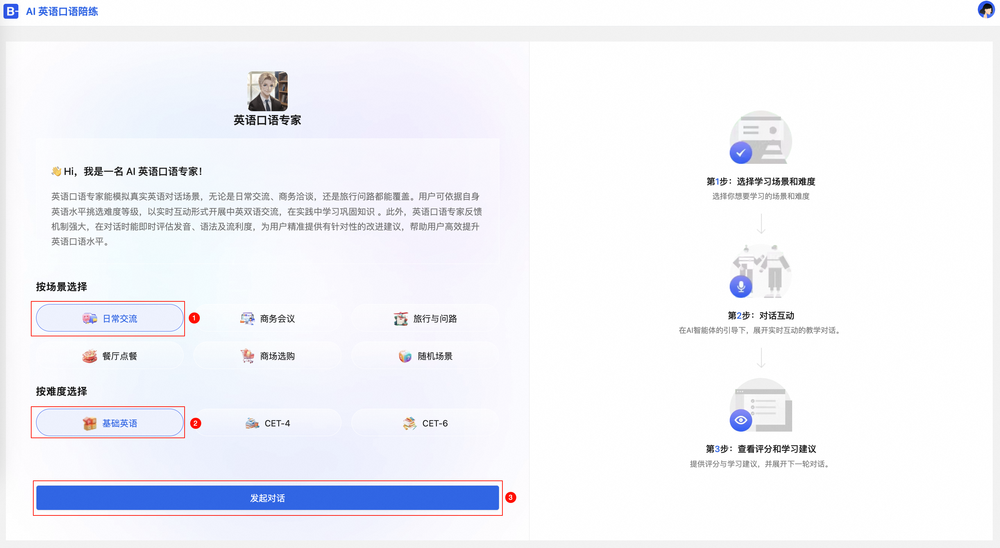
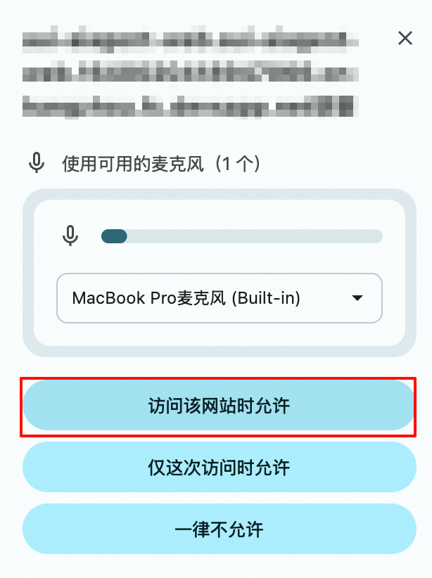
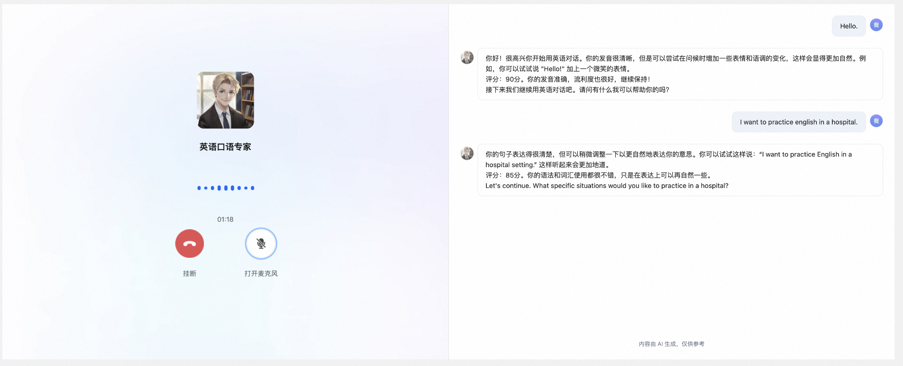

## 简介
AI 陪练，作为智能化的专属训练伙伴，能够提供实时反馈与精准指导，助力用户高效提升技能。本方案以英语口语教学和企业内部培训为应用场景，依托大模型技术，通过模拟真实对话场景，支持文本及语音交互，实现个性化学习与即时反馈，为用户打造沉浸式的学习体验。

## 计费说明

本服务在阿里云上的费用主要涉及：

* 所选GPU云服务器的规格
* 磁盘容量
* 公网带宽

计费方式：按量付费（小时）或包年包月
预估费用在创建实例时可实时看到。

## RAM账号所需权限

| 权限策略名称                          | 备注                         |
|---------------------------------|----------------------------|
| AliyunECSFullAccess             | 管理云服务器服务（ECS）的权限           |
| AliyunVPCFullAccess             | 管理专有网络（VPC）的权限             |
| AliyunROSFullAccess             | 管理资源编排服务（ROS）的权限           |
| AliyunComputeNestUserFullAccess | 管理计算巢服务（ComputeNest）的用户侧权限 |

## 前置步骤

  请参考[解决方案](https://www.aliyun.com/solution/tech-solution-deploy/2861523?spm=a2c4g.2862596.0.0.76e6470a3GmDhZ)创建实时音视频通信应用、实时工作流和AI智能体。在后续的步骤中，需要使用到实时音视频AppId、实时音视频AppKey和语音通话智能体的AgentId。

## 部署服务

1. 单击[部署链接](https://computenest.console.aliyun.com/service/simple/deploy?ServiceId=service-7986f4f24f504ceb9989)
   ，进入服务实例部署界面，根据界面提示，填写参数。
    

2. 确认订单完成后点击**立即创建**，等待部署完成后进入服务实例详情。

3. 单击公网访问地址，在浏览器中，会自动跳转为 HTTPS 链接地址。提示安全证书警告或错误，可以选择点击高级选项，然后点击继续前往以访问该网站。
    

4. 选择您想要学习的场景和难度，开始对话互动。
    

5. 在每轮对话过程中，AI助手将根据您当前的回答提供评分，并给出针对性的学习建议，帮助您不断提升，期间可以使用Tab 键进行打断。

   说明:浏览器弹窗请求使用麦克风，点击访问该网站时允许。

    

    